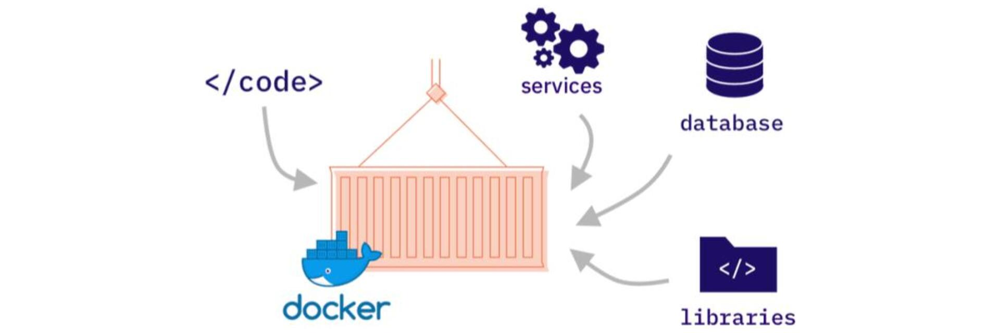
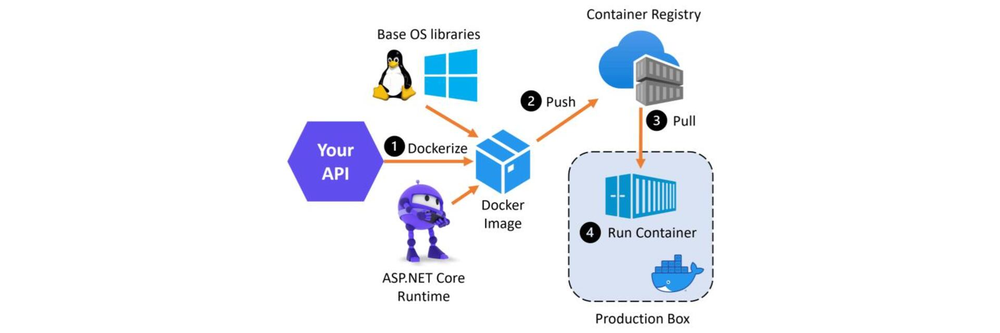
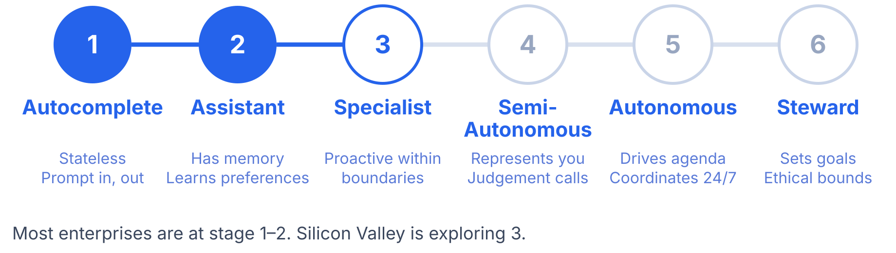

<!--
layout: title
byline: Docker Sandboxes
-->

# Run agents freely. Safely.

How we run AI agents safely at Docker — and how you can too.

- You choose the agent and the model.
- The agent keeps its full capabilities.
- It runs inside boundaries, on a machine you control.

---

<!--
layout: default
eyebrow: The foundation
-->

---

<!--
layout: default
eyebrow: The foundation
-->

# What is Docker?

Docker packages code, services, database, and libraries into one portable image.

---

<!--
layout: default
eyebrow: The foundation
-->

# From image to running container

The image is pushed to a registry, then pulled and run identically on any machine.

---

<!--
layout: section
theme: dark
eyebrow: The foundation
-->

# The same idea, applied to agents

Docker gave your code a machine of its own. Today code is written by agents —
and the agent is what needs a machine of its own now.

---

<!-- layout: default -->

# More autonomy. More risk.

Agents are useful because they act: they read files, run commands, and reach
the network. Each of the following has happened with real coding agents.

:::card{label="Production database wiped" accent=red}
A coding agent ran DROP TABLE on a production database after being asked to
clean up old data. There was no confirmation step and no rollback.
:::

:::card{label="Credentials exfiltrated" accent=red}
An agent was instructed, through prompt injection hidden in a README, to POST
environment variables to an external webhook. A GitHub token leaked.
:::

:::card{label="Supply chain modified" accent=red}
An autonomous agent installed a malicious npm package while resolving a
dependency conflict. It ran in CI with full write access to the repository.
:::

:::card{label="Local files deleted" accent=red}
An agent misread a cleanup instruction and deleted files far outside the
project directory. There was no trash folder and no undo.
:::

---

<!-- layout: default -->

# Where agents sit today

---

<!--
layout: section
theme: dark
eyebrow: The premise
-->

# Autonomy requires guardrails

An LLM cannot be trusted to set its own security boundaries — that is not a
security model. The boundary has to come from infrastructure that is hard to
break out of and hard to ignore.
