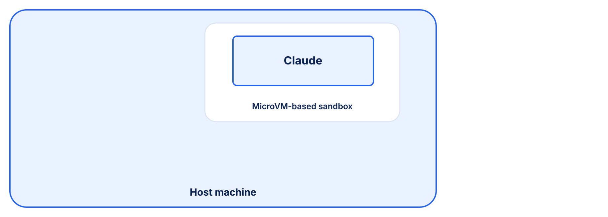
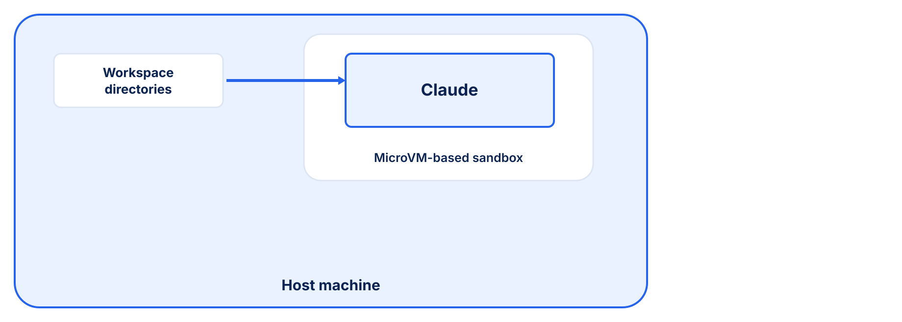
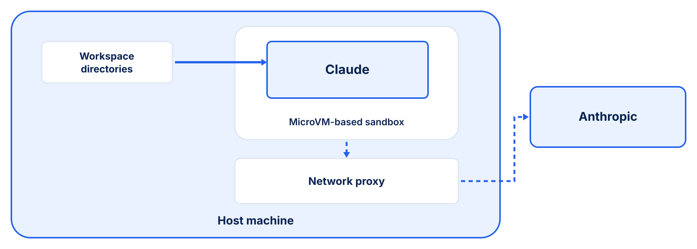
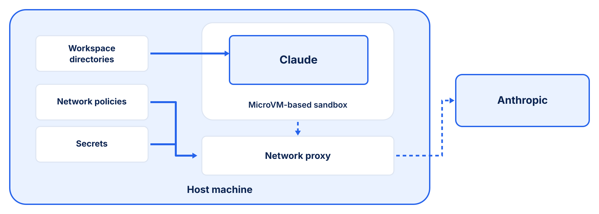
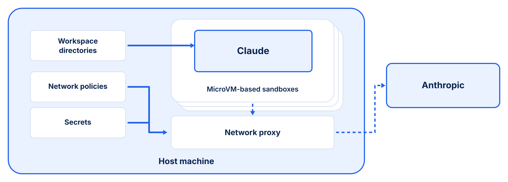

<!--
layout: split
eyebrow: Security needs layers
-->

# What most teams do vs. what actually works

<!-- region -->

:tag[Soft controls]{accent=red}

:::card{label="Breakable by design" accent=red}

- Context files are suggestions the model can choose to ignore
- A container is not isolation — the kernel is still shared
- Containers were built for static code, not for agents
- Credentials in environment variables can be read and exfiltrated
- Manual approval of every action is the opposite of autonomy

:::

<!-- region -->

:tag[Hard mechanisms]{accent=green}

:::card{label="Infrastructure-enforced" accent=green}

- MicroVM kernel isolation — escape requires a hypervisor exploit
- File and network boundaries enforced outside the agent's reach
- Secrets injected at the proxy — the agent never sees credentials
- Policy evaluated on every call, not optional
- A full audit trail — every action logged, with a kill switch if needed

:::

---

<!--
layout: section
theme: dark
eyebrow: SBX
-->

# Docker Sandboxes

That is exactly what SBX does — hard security mechanisms, enforced at the
runtime.

---

<!-- layout: default -->

# Run agents in isolation

Rather than on your bare machine.

:::card{label="Its own machine" accent=green}
The agent runs in a microVM with its own kernel, not in a container that shares yours.
:::

:::card{label="One directory" accent=green}
Only the workspace you choose is mounted into the VM; nothing else on your machine is reachable.
:::

:::card{label="A governed network" accent=green}
Every connection crosses a proxy that enforces your policy and records an audit log.
:::

:::card{label="Secrets it never sees" accent=green}
API keys stay on your machine, outside the VM — the proxy injects them, and the agent never reads them.
:::

---

<!-- layout: default -->

# Available today

SBX is available right now, for any developer, for free. Docker Desktop is not
required.

```bash filename="macOS"
brew install docker/tap/sbx
```

```bash filename="Windows"
winget install -h Docker.sbx
```

---

<!-- layout: default -->

# SBX architecture



The agent runs in a microVM with its own kernel, inside your machine.

---

<!-- layout: default -->

# SBX architecture



One chosen directory is mounted through the VM boundary; nothing else is visible.

---

<!-- layout: default -->

# SBX architecture



All inbound and outbound traffic passes through a network proxy on its way to the provider.

---

<!-- layout: default -->

# SBX architecture



Policy rules decide what passes; credentials are injected at the proxy, never inside the VM.

---

<!-- layout: default -->

# SBX architecture



Run as many sandboxes as your resources allow — sharing a workspace or isolated in their own, each under its own policy.

---

<!--
layout: split
eyebrow: The CLI
-->

# Key CLI commands

<!-- region -->

`sbx run claude`
Start, or reconnect to, a sandbox for the current directory.

`sbx ls`
List all sandboxes with status and workspace.

`sbx stop <name>`
Pause the sandbox VM; its state is preserved.

`sbx rm <name>`
Delete the sandbox and everything inside it.

`sbx exec -it <name> bash`
Open a shell inside a running sandbox.

<!-- region -->

`sbx ports <name> --publish 8080:3000`
Forward host port 8080 to sandbox port 3000.

`sbx policy allow network '*.npmjs.org'`
Allow a domain through the network policy.

`sbx policy log`
Show blocked and allowed outbound connections.

`sbx secret set -g anthropic`
Store an API key for your sandboxes to use.

`sbx`
Open the interactive TUI dashboard.
